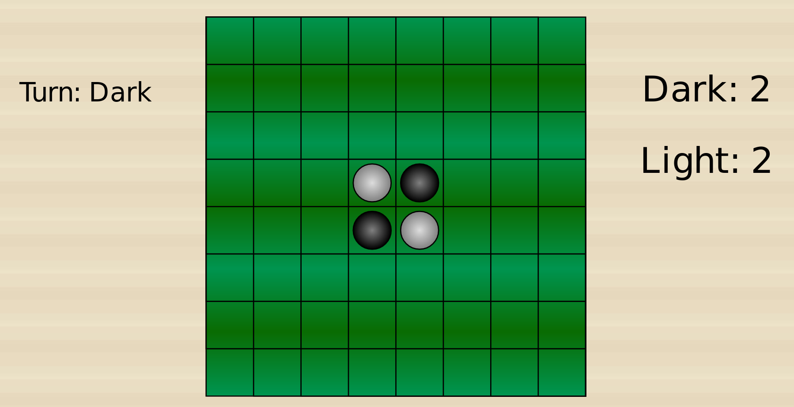
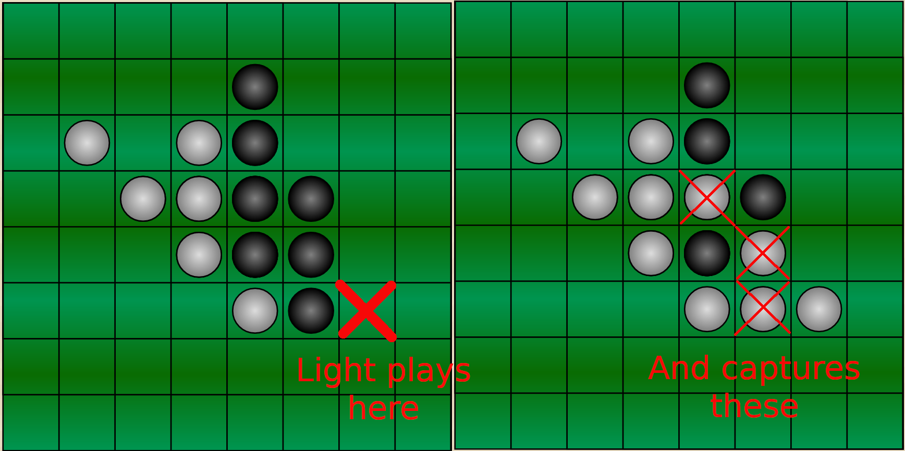
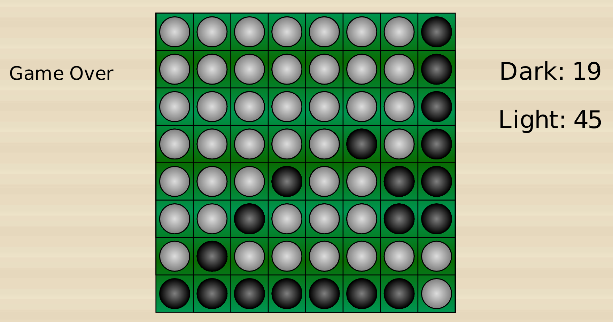

#Australian National University
#Othello

Table of Contents

  * [Before you begin](#before-you-begin)
  * [The task](#the-task)
    * [Rules](#rules)
    * [Implementation](#implementation)
    * [The framework](#the-framework)
    * [Where to start](#where-to-start)
    * [Interlude](#interlude)
    * [Making a good move](#making-a-good-move)
    * [Making a better move](#making-a-better-move)
    * [Minimax](#minimax)
    * [Writing a stronger AI](#writing-a-stronger-ai)
  * [Deliverables](#deliverables)
    * [Code (70%)](#code-70)
    * [Report (30%)](#report-30)
      * [Content](#content)
  * [Communicating](#communicating)
  * [Submission Checklist](#submission-checklist)
  * [Marking](#marking)
  * [Final Words](#final-words)

## Installation instructions
```sh
curl -sSL https://get.haskellstack.org/ | sh    
echo 'export PATH="$PATH:/path-to-stack"' >> ~/.zshrc  
source ~/.zshrc
stack setup   
stack init     
stack build  
stack exec othello
```
## Before you begin

Before you begin this assignment, you should be comfortable writing recursive
functions and manipulating lists. If you aren't, you should revisit the
lectures and labs on these topics before attempting this assignment. If you
attempt to do this assignment without being able to do these things, you'll
just end up wasting your time and becoming frustrated.

For this assignment, GHC is set to be a bit more pedantic than the previous
two assignments. It will treat all warning as errors, and you'll only be able
to write "Safe" Haskell. Assuming that you're writing good code, you shouldn't
notice this at all, apart from that if you try to use `trace` and similar from
`Debug.Trace` your code will fail to compile.

## The task

The task for this assignment is to write an AI (also known in the
context of game playing as a bot)
which can play the game Othello.

### Rules

Othello (also known as Reversi) is board game played on an 8x8 board
with 64 discs which are light on one side and dark on the other.

The game starts with 4 discs in the centre of the board, two dark
and two light.



To make a move a player places a disc with their colour facing up on an 
unoccupied square on the board such that it will capture at least one
of the opponents discs.

Capturing occurs if the placed disc forms a line (horizontal, vertical
or diagonal) that has one or more of the opponents discs on it and is
ended by another of the current player's discs, with none of the current
player's discs in-between. All of the opponents
discs on this line are flipped over, becoming the current player's discs.
It possible (and in fact quite common) for a single move to capture more
than one line, and pieces which can be captured in a move must be
captured.



The dark player plays first, and play alternates between the two players.
If a player can't make a legal move, their turn is skipped. If neither
player can make a legal move, the game is over
and the player with the most discs wins.

### Implementation

You don't need to implement the rules of Othello yourself, we've done that for
you. The code has been written with readability in mind and is hopefully
understandable. If you come across a function you're unfamiliar with,
ask GHCi for its type, search for it on [Hoogle](https://www.haskell.org/hoogle/),
read the documentation and try using it yourself inside GHCi.

### The framework

The framework consists of several files, many of which are of little
interest to you. In particular anything in the file `Main.hs` can be
ignored, as well as anything in the folder `Dragons`.
(On medieval maps they drew pictures of dragons or sea monsters on
uncharted areas, and the code contained in these files is
beyond the areas of Haskell which this course explores).

That leaves us with 4 files:
  - `AI.hs`
  - `Config.hs`
  - `Game.hs`
  - `GameState.hs`

Of these files, `Config.hs` may also be safely ignored, but unlike
the other files you can ignore, it doesn't contain anything beyond
the scope of this course.

The first file you'll need to look at is `GameState.hs`. It contains
the data structures for the game (but none of the logic for the game).

The second file you'll need to familiarise yourself with is `Game.hs`.
It contains the game logic for Othello. It includes functions for
checking if a move is legal or not, getting the score for a given
`Player` or actually playing a move.

The final file you need to care about (and arguably the most important
file) is `AI.hs`. Currently it's fairly empty, containing only three
things. A list of `AI`s with only a single entry, and a single
unimplemented `AI` which is split into two functions, `makeBestMove`
and `makeAMove`. To start off with, you can ignore `makeBestMove` and
instead focus on `makeAMove`. **This is the only file you may modify
(with one exception, mentioned later) and you cannot change the
definition of the type `AI`.**

### Where to start

First of all, make sure that the initial framework will compile and
run on your computer. Start a game by running `cabal run othello`.

It should say something like "See the game at http://127.0.0.1:3000".
Open this in a web browser, and click on a square to make a move as the
`Dark` player. Unfortunately, the game is going to stop running after
that. The default behaviour is to play a game against a bot named
`"helloWorld"`, but currently no such bot exists. We need to fix that.

Open up `AI.hs` in the `src` folder. Add `("helloWorld", makeFirstLegalMove)` 
to the list of `ais`. It should now look like.

```haskell
-- | A list of known AIs and their names.
ais :: [(String, AI)]
ais = [("default", makeBestMove), ("helloWorld", makeFirstLegalMove)]
```

Alright, we've now registered an AI called `"helloWorld"` which is
defined by the function `makeFirstLegalMove`. Now we just need to define
the `makeFirstLegalMove` function. For Othello we have an 8x8 board,
and because we index from 0, a move is defined as pair `(row,col)` where
both `row` and `col` are between 0 and 7 (inclusive). We can easily make
a list of all possible moves using a list comprehension.

```haskell
-- | A list of possible moves for the players.
possibleMoves :: [(Int,Int)]
possibleMoves = [(row,col) | row <- [0..7], col <- [0..7]]
```

Add this to your `AI.hs` file.

Now, from all these possible moves, we want to return only those which
are legal for a given game. By using the functions defined in `Game.hs`
we can write a new function

```haskell
-- | A list of valid moves from all possible moves for a given game.
legalMoves :: Game -> [(Int,Int)]
legalMoves (Game Nothing _) = [] -- The game is over
legalMoves (Game (Just player) board) =
  filter legalForThisGame possibleMoves
  where
    legalForThisGame (row,col) = legalMove row col player board
```

So now we have a function, which given a game can tell us what all the
legal moves are. We're now ready to define `makeFirstLegalMove`.

```haskell
-- | Pick the first legal move for the game.
makeFirstLegalMove :: AI
makeFirstLegalMove _ game = case legalMoves game of
  [] -> error "makeFirstLegalMove: No Legal moves"
  move:_ -> [move]
```

Under normal circumstances, an `AI` would return a list of increasingly
better moves until time runs out. However no matter how long we look
at it, the first legal move isn't going to change, so we just return
a single move - the first one in our list of legal moves.

Add that to your `AI.hs` file, save it, and try running the game again
(`cabal run othello`). Hopefully you should now be able to play a full
game. If you want to play again just refresh the page.

Now is a good time to commit and push your code.

```bash
git commit -a -m"first legal move"
git push
```

### Interlude

Now that you've written your first bot, it's time to write an even
better bot. But before you do that, you need to know how to play
against it. `cabal run othello` runs the program with the default
settings. That is, a human player playing against an AI called
`"helloWorld"`. To do something different than the default settings,
you'll need to give the program arguments.
Run `cabal run othello -- --help` and you should see something like

```
Usage: othello [OPTION...]
  -T GAMETYPE    --type=GAMETYPE      The type of the game. One of console, gui, host, join and tournament. Defaults to gui.
  -t TIMEOUT     --timeout=TIMEOUT    The timeout (in seconds) for the game.
  -p PLAYER1     --player1=PLAYER1    Player 1 (or the only player for single player games). HUMAN if a human player. Defaults to human.
  -P PLAYER2     --player2=PLAYER2    Player 2 (HUMAN if a human player). Defaults to the AI helloWorld.
  -h HOSTNAME    --hostname=HOSTNAME  Hostname of the computer to connect to for a network game or tournament.
  -n PORTNUMBER  --port=PORTNUMBER    The port number to connect to or host on for a network game. Defaults to 9001.
  -h             --help               Prints this help message and exits.

```

As you can see, there are more modes of playing the game than just the
GUI in the web browser, but the two most important options are
`--player1` and `--player2`. So let's say you wanted to play with two
human players. You'd start the game with
`cabal run othello -- --player1=HUMAN --player2=HUMAN`. Of course, since
the default for player 1 is already human, you can omit that, and if you
don't feel like typing so much, you can use the short option for
player 2, giving you `cabal run othello -- -P HUMAN`. Or if for example
you wanted to watch two of the `"helloWorld"` AIs face off, you can run
`cabal run othello -- --player1=helloWorld --player2=helloWorld`.

The one exception to the "only modify `AI.hs` rule" is that you may
modify `Config.hs` so that player 2 has a different default AI than
`"helloWorld"` (for example to the aptly named `"default"` `AI`).

Check that you've understood this by playing your `"helloWorld"` bot
against itself. The final position should look like.



### Making a good move

To make a good AI, we need to have a way of deciding what is, and what
isn't a good move. A good place to start, is by trying to work out what
are, and what aren't, good board positions. As you may have noticed,
the score given in the game can move by quite a bit in a single turn,
so by itself it may not be the best indicator of whether or not a
board position is good.

The first step on the way to success is writing what's known as a
greedy bot. This is simply an AI, who looks at all possible next moves,
and picks the move which will give it the best board position. Now if
we had a perfect function for rating board positions, we could stop
here. Unfortunately Othello is not a solved game (yet).

If you have a greedy bot working, now would be a good time to
commit and push.

```bash
git commit -a -m"greedy bot"
git push
```

### Making a better move

Unless your scoring function is highly unusual, the closer to the end
of the game you get, the more accurate it will be. If we're lucky
it can also identify the difference between a position that's bad
for us, and a position that's _really_ bad for us.

So instead of looking just one turn into the future like a greedy bot
would, we can try looking several turns into the future, both to
increase the accuracy of our scoring function, and avoiding the common
pitfall that a greedy bot has of playing a move that seems really good,
only for the opponent to have an even better move next turn.

### Minimax

There's a commonly used algorithm in games like Othello for doing
just this - it's known as minimax. It operates under the assumption
that both you and your opponent are playing the best moves at each
step.

Here's a rough outline of how it works.
1. Pick a depth that you're going to lookahead to.
2. Build out a game tree to the given depth for each possible move.
3. Give each node a score, for a leaf node it's the score that
    your scoring function gives the board, and for
    an inner node its value is either the maximum (if it's our
    turn in the game at the current node) or the minimum (if it's our
    opponent's turn in the game at the current node) of the value
    of its children.
4. Pick the move which has the game tree who's root node has the
    highest score.

When you write an AI, you'll probably call this function several times
in a single turn with increasingly greater depths until it runs out
of time. Unfortunately in the GUI, the depth of the search isn't
displayed, but if you run it in `console` mode (remember, you can see
the options at any time with `cabal run othello -- --help`) it will
tell you how far it looks ahead. _If it's returning a very large
number, that probably means you've searched to the end of the tree._

There are several optimisations to minimax, but one of the most effective
is known as
[Alpha Beta Pruning](https://en.wikipedia.org/wiki/Alpha%E2%80%93beta_pruning)

### Writing a stronger AI

Once you've gotten a bot with Minimax with Alpha-Beta pruning, there's
still room for improvement.
- Try and sort your moves for Alpha Beta pruning to have a better
    move ordering, since Alpha Beta pruning works best if
    looks at the best moves first.
- There are algorithms such as Negascout or
MTD(f) which attempt to improve on Alpha-Beta pruning.
- If most of your time is spent calculating new boards, because the
    provided code is slow, you can write your own faster version of
    Othello (although if you do, all code **must** go in `AI.hs`).
- You can go back and tweak your heuristic.

## Deliverables

### Code (70%)

You're required to submit an AI which can play Othello called
`"default`". (i.e if I call
`cabal run othello -- -p "default" -P "default"` I should be able to
watch it play against itself.)

You can include as many other AIs as you'd like, but `"default"` should
be your strongest. It doesn't need to implement any algorithm in
particular, but it should be more advanced than a greedy bot.

The only file which will be looked at is your `AI.hs` file. It must be
able to work without modification with the initial assignment framework.
If it doesn't this will be treated the same as having non-compiling
code.

### Report (30%)

You are required to write a concise [technical report](https://cs.anu.edu.au/courses/comp1100/resources/06-reports/)
explaining your design choices in completing your program, its 
implementation, a self-critique of your work, and potential improvements 
you could make. It **must be no longer than 1500 words**.

Your report must be in PDF format, located at the root of your assignment
repository (the folder with `othello.cabal`, not in the `src` folder) on GitLab
and named `Report.pdf`. Otherwise it may not be marked.

The report must have a **title page** with the following items:

- Your name
- Your laboratory time and tutor's name.
- Your university ID
- Collaborators (if any)

#### Content

Keep in mind that your audience is your tutors and the lecturers, who are
proficient at programming and understand most programming concepts. Therefore,
for example, describing how minimax[^minimax] works in your report is not necessary.

[^minimax]: You should still explain how your code implements minimax, just
    not how minimax itself works.

After reading a technical report, the reader should be comprehensively aware of
what problem the program is trying to solve, the reasons for major design 
choices in the program, as well as how it was tested.

Below is a list of questions that you might consider discussing in your report.
These are only suggestions, you don't need to answer all of them.

- How does your AI select a move?
- What data structures did you use?
- Did you write several different AIs or just keep improving one?
- What were the conceptual or technical issues that you encountered whilst 
    doing the assignment, and how did you get past them?
- What were the assumptions that you had to make during the assignment?
- What would you have done differently if you were to do it again?
- How would you make your AI better?
- How did you test your code?
- Which parts of your code might be confusing for the reader? Explain them if so.

Aside from what should be in your report, here are some things that should 
definitely not be in it:

- Any content that is not your own.
- Grammatical errors or misspellings. Proof-read it before submission.
- Informal language. This includes unnecessary abbreviations 
    (atm, btw, ps, and so on), emojis, and emoticons. Keep in mind that 
    this is a professional document.
- Diagrams, graphs, and charts that are not relevant. Any unnecessary elements
    will distract from the actual content. Keep it succinct and focused.

## Communicating

Do not post your code publicly, either on Piazza or via other forums. 
If by mistake you post your code publicly on Piazza, an email containing
your post with your code will be sent to all students. 
This means that others will have access to your code and you may be held
responsible for plagiarism.

Once again, and we cannot stress this enough: do not post your code publicly.
If you need help with your code, post it privately to the instructors.

When brainstorming with your friends, do not show your code to them. There
might be some pressure from your friends and even some judgements that you are
not sharing the code, but it is for both your and their benefit.

_Anything that smells of plagiarism will be dealt with seriously and there may
be serious consequences._

Sharing ideas is perfectly fine, but sharing should stop at ideas. In
particular for this assignment you may wish to discuss board evaluation
heuristics. You may do so, but under no circumstances give anyone else
your code for scoring a board.

Course staff will not look at assignment code unless it is posted privately
in piazza.

Course staff will typically give assistance by directing you to relevant 
exercises from the labs, or definitions and examples from the lectures.

Before the assignment is due, course staff will not give individual tips on
writing functions for the assignment or how your code can be improved. You 
will receive their feedback when the mark is released.

## Submission Checklist

Preferably **24 hours prior to the assignment deadline**, you should make sure that:

- You've fully read and understand the assignment specification.
- Your code works on the lab machines (it both compiles and the AI `"default"`
    can play a game without crashing.)
- Your latest commit is pushed to GitLab. Ensure this by going to the web
    interface of GitLab and check manually.
- Your report is on GitLab, as a PDF

Some of the marks will be attributed to the styling of
your code. Thus it's important that you do not have any obfuscated code or
unnecessary repetitions in the code. Your file should be correctly indented
uniformly throughout and **lines should not be longer than 80 characters 
long.**

## Marking

The marking is divided roughly into 70% for the code and 30% for the report.
For exceptional reports or exceptional code we might take the liberty to shift
those percentages slightly to acknowledge extra efforts.

Marks in the code will be awarded for functionality, clarity, and how 
effectively it can play Othello.

Marks in the report will be awarded to concise writing, completeness of the
report, and your understanding of your own designs and findings.

Here is a breakdown of example student cases with different marks awarded:

|Grade           |Criteria|
|----------------|--------|
|Pass            |Code compiles and the AI can reliably beat an AI who makes the first legal move. The report shows basic understanding of the problem and explains the submitted code.|
|Credit          |Code compiles and the AI can reliably beat a greedy AI with a weak heuristic. The code is well structured and well supported in the report.|
|Distinction     |Code compiles and the AI can reliably beat a minimax AI with a weak heuristic. The code is well structured and the report is excellently written.|
|High Distinction|Code compiles and the AI can reliably beat a minimax AI with an above average heuristic and pruning. The report is excellently written and explains in detail which additional measures have been taken and how they have been implemented.|

Roughly, you can expect to reach a distinction level mark with an excellent 
submission of a minimax based solution with a strong heuristic, or a
minimax solution with pruning and a weak heuristic.

## Final Words

There may be a tournament involving all of your submissions, but if there is,
it will be anonymous and its results will have no impact on your final mark.

There may also be some additions or changes made to
the framework, so pull from upstream regularly. However, barring any large 
issues being found, `AI.hs`, `Game.hs` and `GameState.hs` will not change
at all.

